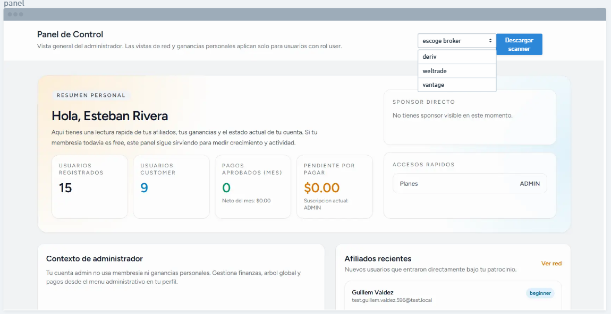
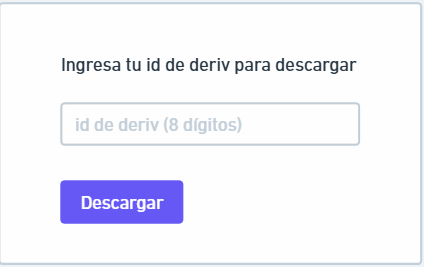
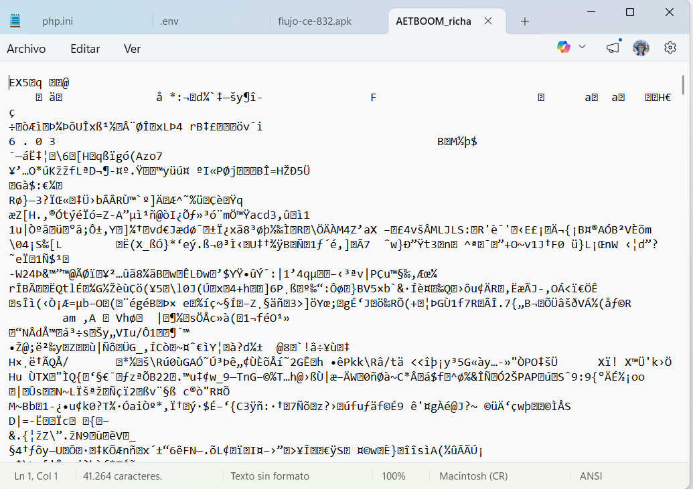

# Scanners en el proyecto

Haré un apartado en el dashboard (panel del usuario) el cual será un botón de descargar scanner para meta trader, verás, primero este botón abrirá un drop down de tres opciones de brokers a descargar el scanner: 

1. deriv
2. weltrade
3. vantage

Al dar clic en una de estas opciones abre un modal el cual le preguntará por input cual es su id de deriv, el cual es un número de 8 dígitos, de ahí el usuario le da a descargar, y empieza la lógica de descarga:


Entonces al dar clic en uno de estos, empieza a descargar el archivo, pero con extensión ex5 (no editable), ya que el código que tengo es mq5 (el archivo editable que nosotros lo manipulamos para cada usuario).

Cada opción descargará un código distinto, que se adapta a su entorno de broker.

## Lógica de descarga de archivo

Antes de descargar, se tomará el id del usuario, y se edita el archivo para descargar, y el usuario no podrá editar ese archivo, es decir estará protegido para no poder hackearlo.

el archivo base para deriv por ejemplo será:

este archivo se editarán las variables:
- CUENTA_AUTORIZADA: se pone el id que el usuario llenó en el input, debe contener solo números, 8 dígitos y no nullable
- FECHA_EXPIRACION: lo tomará de la fecha de expiración de la membresía (user->membership->fecha_expiracion)

Luego de editar estas dos variables, se descarga ahora si para el usuario, pero debe nombrarse  así el archivo:
AET{nombre_patron}_{nombre_usuario}.ex5
ejemplo:
```sh
AETBOOM_pablojimenez.ex5
```

Los patrones para cada broker son dos, es decir se descargarán dos archivos (compra y venta)
Los patrones de deriv: para compra se llama BOOM, y para venta se llama CRASH
Los patrones de weltrade: para compra se llama gainx y para venta painx

entonces el descargar, para cada broker, descargará dos archivos (compra y venta)

## Códigos
los archivos base a editar y descargar, los dejaré en storage/public/scanners/
Solo verás de deriv (boom y crash) y weltrade (gainx y painx) por el momento, pero más adelante también agregaré de vantage.

Estarán en formato mq5 para que puedas leerlos, pero solo es para código, ya que para entregar al cliente (descarga), este archivo se verá encriptado o protegido, no se puede editar, viendose algo así:


y la extensión del arvhico sería ex5 viendose así:
```sh
// ejemplo para deriv
AETBOOM_pablojimenez.ex5
AETCRASH_pablojimenez.ex5
```

### Código BOOM de Deriv
```sh
#property strict
#property description "AET Combined Scanner MULTI-TIMEFRAME BOOM: SCN1 (gap) + SCNB (-70/-120) + SL(-220)"
#property version   "6.03"

#define SCAN_VELAS 2000

// =====================
// 🔒 LICENCIA NIVEL PRO
// =====================
input long     CUENTA_AUTORIZADA =62370559; // cuenta permitida
input datetime FECHA_EXPIRACION  = D'2026.05.09'; // AAAA.MM.DD

// 🔥 TIMEFRAME DINÁMICO - Se adapta automáticamente al gráfico actual
ENUM_TIMEFRAMES TF;

// =====================
// SCN1 (GAP) CONFIG
// =====================
input string Prefix_SCN1 = "SCN1_BOOM_";
input color  ColorRectangulo_SCN1 = clrRed;
input color  ColorLinea_SCN1      = clrWhite;
input int    AnchoLinea_SCN1      = 1;

// =====================
// SCNB (-70) CONFIG
// =====================
input string Prefix_SCNB = "SCNB_BOOM_";
input color  ColorLinea70  = clrDodgerBlue;
input int    AnchoLinea70  = 1;

// =====================
// SCNB (-120) CONFIG
// =====================
input color  ColorLinea120 = clrAqua;
input int    AnchoLinea120 = 1;

// =====================
// SCNB (-220) STOP CONFIG
// =====================
input color  ColorLinea220 = clrRed;
input int    AnchoLinea220 = 1;

// =====================
// CONFIGURACIÓN DE ALERTA
// =====================
input double PUNTOS_ANTES_ALERTA = 5.0;
input int SEGUNDOS_DELAY_ELIMINACION = 3;

// =====================
// ESTADO GENERAL
// =====================
datetime ultimaVela = 0;
int patronCounter_SCN1 = 0;
int patronCounter_70   = 0;
int patronCounter_120  = 0;
int patronCounter_220  = 0;

bool esEscaneoHistorico = false;

// =====================
// ARRAYS SCN1
// =====================
string scn1_lineas[];
double scn1_niveles[];
bool   scn1_alertaEnviada[];
datetime scn1_tiempoToque[];

// =====================
// ARRAYS SCNB -70
// =====================
string scnb70_lineas[];
double scnb70_niveles[];

// =====================
// ARRAYS SCNB -120
// =====================
string scnb120_lineas[];
double scnb120_niveles[];

// =====================
// ARRAYS SCNB -220 (STOP)
// =====================
string scnb220_lineas[];
double scnb220_niveles[];

//--------------------------------------------------
// Helpers
//--------------------------------------------------
bool EsBoom(const string sym) { 
   return (StringFind(sym, "BOOM") >= 0 || 
           StringFind(sym, "Boom") >= 0 || 
           StringFind(sym, "boom") >= 0); 
}

//--------------------------------------------------
// 🔥 MQL5: Obtener precio de una vela
//--------------------------------------------------
double iOpenMQL5(string symbol, ENUM_TIMEFRAMES timeframe, int shift)
{
   double open[];
   ArraySetAsSeries(open, true);
   if(CopyOpen(symbol, timeframe, shift, 1, open) > 0)
      return open[0];
   return 0;
}

double iCloseMQL5(string symbol, ENUM_TIMEFRAMES timeframe, int shift)
{
   double close[];
   ArraySetAsSeries(close, true);
   if(CopyClose(symbol, timeframe, shift, 1, close) > 0)
      return close[0];
   return 0;
}

double iHighMQL5(string symbol, ENUM_TIMEFRAMES timeframe, int shift)
{
   double high[];
   ArraySetAsSeries(high, true);
   if(CopyHigh(symbol, timeframe, shift, 1, high) > 0)
      return high[0];
   return 0;
}

double iLowMQL5(string symbol, ENUM_TIMEFRAMES timeframe, int shift)
{
   double low[];
   ArraySetAsSeries(low, true);
   if(CopyLow(symbol, timeframe, shift, 1, low) > 0)
      return low[0];
   return 0;
}

datetime iTimeMQL5(string symbol, ENUM_TIMEFRAMES timeframe, int shift)
{
   datetime time[];
   ArraySetAsSeries(time, true);
   if(CopyTime(symbol, timeframe, shift, 1, time) > 0)
      return time[0];
   return 0;
}

int iBarsMQL5(string symbol, ENUM_TIMEFRAMES timeframe)
{
   return Bars(symbol, timeframe);
}

//--------------------------------------------------
// 🔥 FUNCIÓN: Convertir timeframe a string
//--------------------------------------------------
string TimeframeToString(ENUM_TIMEFRAMES tf)
{
   switch(tf)
   {
      case PERIOD_M1:  return "M1";
      case PERIOD_M5:  return "M5";
      case PERIOD_M15: return "M15";
      case PERIOD_M30: return "M30";
      case PERIOD_H1:  return "H1";
      case PERIOD_H4:  return "H4";
      case PERIOD_D1:  return "D1";
      case PERIOD_W1:  return "W1";
      case PERIOD_MN1: return "MN1";
      default:         return "UNKNOWN";
   }
}

//--------------------------------------------------
// 🔥 FUNCIÓN: Limpiar todos los objetos del timeframe anterior
//--------------------------------------------------
void LimpiarObjetosAnteriores()
{
   for(int i = ObjectsTotal(0) - 1; i >= 0; i--)
   {
      string name = ObjectName(0, i);
      if(StringFind(name, Prefix_SCN1) >= 0 || StringFind(name, Prefix_SCNB) >= 0)
      {
         ObjectDelete(0, name);
      }
   }
   
   ArrayResize(scn1_lineas, 0);
   ArrayResize(scn1_niveles, 0);
   ArrayResize(scn1_alertaEnviada, 0);
   ArrayResize(scn1_tiempoToque, 0);
   
   ArrayResize(scnb70_lineas, 0);
   ArrayResize(scnb70_niveles, 0);
   
   ArrayResize(scnb120_lineas, 0);
   ArrayResize(scnb120_niveles, 0);
   
   ArrayResize(scnb220_lineas, 0);
   ArrayResize(scnb220_niveles, 0);
   
   patronCounter_SCN1 = 0;
   patronCounter_70 = 0;
   patronCounter_120 = 0;
   patronCounter_220 = 0;
}

//--------------------------------------------------
// INIT
//--------------------------------------------------
int OnInit()
{
   // =====================
   // 🔒 VALIDACIÓN LICENCIA
   // =====================
   if(CUENTA_AUTORIZADA != 0 &&
      AccountInfoInteger(ACCOUNT_LOGIN) != CUENTA_AUTORIZADA)
   {
      Alert("❌ Cuenta no autorizada");
      return INIT_FAILED;
   }

   if(TimeCurrent() > FECHA_EXPIRACION)
   {
      Alert("❌ Licencia expirada");
      return INIT_FAILED;
   }
   
   if(!EsBoom(_Symbol))
   {
      Print("⛔ EA válido SOLO para BOOM. Símbolo actual: ", _Symbol);
      return INIT_FAILED;
   }
   
   // 🔥 DETECTAR TIMEFRAME DEL GRÁFICO ACTUAL
   TF = Period();
   Print("📊 TIMEFRAME DETECTADO: ", TimeframeToString(TF));
   
   LimpiarObjetosAnteriores();
   
   EventSetTimer(5);
   
   Print("⏱️ Timer configurado: análisis cada 5 segundos");
   Print("⏱️ Delay de eliminación: ", SEGUNDOS_DELAY_ELIMINACION, " segundos");
   Print("✅ EA combinado iniciado con notificaciones n8n");
   Print("📡 Alertas configuradas para ", PUNTOS_ANTES_ALERTA, " puntos ANTES de línea blanca");
   
   esEscaneoHistorico = true;
   
   EscanearHistorico_SCN1();
   EscanearHistorico_SCNB70();
   EscanearHistorico_SCNB120();
   EscanearHistorico_SCNB220();
   
   esEscaneoHistorico = false;
   
   Print("✅ Escaneo histórico completado. Patrones encontrados:");
   Print("   - SCN1: ", ArraySize(scn1_lineas));
   Print("   - SCNB -70%: ", ArraySize(scnb70_lineas));
   Print("   - SCNB -120%: ", ArraySize(scnb120_lineas));
   Print("   - SCNB -220%: ", ArraySize(scnb220_lineas));
   
   return INIT_SUCCEEDED;
}

void OnDeinit(const int reason)
{
   EventKillTimer();
   Print("✅ Timer eliminado correctamente");
}

//--------------------------------------------------
// 🔥 NUEVO: Detectar cambio de timeframe
//--------------------------------------------------
void OnTimer()
{
   if(!EsBoom(_Symbol)) return;
   
   // 🔥 DETECTAR SI CAMBIÓ EL TIMEFRAME
   ENUM_TIMEFRAMES timeframeActual = Period();
   if(timeframeActual != TF)
   {
      Print("🔄 CAMBIO DE TIMEFRAME DETECTADO: ", TimeframeToString(TF), " → ", TimeframeToString(timeframeActual));
      TF = timeframeActual;
      
      // Limpiar todo y re-escanear
      LimpiarObjetosAnteriores();
      
      esEscaneoHistorico = true;
      EscanearHistorico_SCN1();
      EscanearHistorico_SCNB70();
      EscanearHistorico_SCNB120();
      EscanearHistorico_SCNB220();
      esEscaneoHistorico = false;
      
      Print("✅ Re-escaneo completado en ", TimeframeToString(TF));
      ultimaVela = 0; // Reset para forzar evaluación en próxima vela
      return;
   }
   
   datetime velaActual = iTimeMQL5(_Symbol, TF, 0);
   
   if(velaActual != ultimaVela)
   {
      ultimaVela = velaActual;
      
      EvaluarPatron_SCN1(3);
      EvaluarPatron_SCNB70(3);
      EvaluarPatron_SCNB120(3);
      EvaluarPatron_SCNB220(3);
   }
   
   VerificarProximidadSCN1();
   EliminarLineasConDelay();
   VerificarToqueLive_SCN1();
   VerificarToqueLive_SCNB70();
   VerificarToqueLive_SCNB120();
   VerificarToqueLive_SCNB220();
}

// ==================================================
// ===================  SCN1 (GAP)  ==================
// ==================================================
void EscanearHistorico_SCN1()
{
   int barras = iBarsMQL5(_Symbol, TF);
   int inicio = MathMin(barras - 3, SCAN_VELAS);
   
   for(int i = inicio; i >= 3; i--)
   {
      EvaluarPatron_SCN1(i);
      EvaluarRetrocesoHistorico_SCN1(i - 1);
   }
}

void EvaluarPatron_SCN1(int i)
{
   if(i < 3) return;
   
   double o1 = iOpenMQL5 (_Symbol, TF, i);
   double c1 = iCloseMQL5(_Symbol, TF, i);
   double h1 = iHighMQL5 (_Symbol, TF, i);
   
   double o2 = iOpenMQL5 (_Symbol, TF, i-1);
   double c2 = iCloseMQL5(_Symbol, TF, i-1);
   
   double o3 = iOpenMQL5 (_Symbol, TF, i-2);
   double c3 = iCloseMQL5(_Symbol, TF, i-2);
   double l3 = iLowMQL5  (_Symbol, TF, i-2);
   
   // 🔥 BOOM: 3 velas ALCISTAS (close > open)
   if(!(c1 > o1 && c2 > o2 && c3 > o3))
      return;
   
   // 🔥 BOOM: GAP ALCISTA (high de vela 1 debe estar ARRIBA del low de vela 3)
   if(h1 >= l3)
      return;
   
   double nivel = c1;
   string id = IntegerToString(patronCounter_SCN1++);
   
   string rect = Prefix_SCN1 + "RECT_" + id;
   ObjectCreate(0, rect, OBJ_RECTANGLE, 0,
      iTimeMQL5(_Symbol, TF, i),   h1,
      iTimeMQL5(_Symbol, TF, i-2), l3);
   
   ObjectSetInteger(0, rect, OBJPROP_COLOR, ColorRectangulo_SCN1);
   ObjectSetInteger(0, rect, OBJPROP_FILL, true);
   ObjectSetInteger(0, rect, OBJPROP_BACK, true);
   
   string line = Prefix_SCN1 + "TL_" + id;
   datetime t1 = iTimeMQL5(_Symbol, TF, i);
   datetime t2 = iTimeMQL5(_Symbol, TF, i-2);
   
   ObjectCreate(0, line, OBJ_TREND, 0, t1, nivel, t2, nivel);
   ObjectSetInteger(0, line, OBJPROP_COLOR, ColorLinea_SCN1);
   ObjectSetInteger(0, line, OBJPROP_WIDTH, AnchoLinea_SCN1);
   ObjectSetInteger(0, line, OBJPROP_RAY_RIGHT, true);
   
   int s = ArraySize(scn1_lineas);
   ArrayResize(scn1_lineas, s + 1);
   ArrayResize(scn1_niveles, s + 1);
   ArrayResize(scn1_alertaEnviada, s + 1);
   ArrayResize(scn1_tiempoToque, s + 1);
   
   scn1_lineas[s] = line;
   scn1_niveles[s] = nivel;
   scn1_alertaEnviada[s] = false;
   scn1_tiempoToque[s] = 0;
   
   if(!esEscaneoHistorico)
   {
      Print("✅ SCN1 detectado | Nivel: ", nivel);
   }
}

void EvaluarRetrocesoHistorico_SCN1(int desde)
{
   for(int l = ArraySize(scn1_lineas) - 1; l >= 0; l--)
   {
      double nivel = scn1_niveles[l];
      
      for(int i = desde; i >= 0; i--)
      {
         double open  = iOpenMQL5 (_Symbol, TF, i);
         double low   = iLowMQL5  (_Symbol, TF, i);
         double close = iCloseMQL5(_Symbol, TF, i);
         
         // 🔥 BOOM: vela BAJISTA que toca la línea blanca
         if(close < open && low <= nivel)
         {
            EliminarLineasAsociadasHistorico(nivel);
            
            string rect = StringSubstr(scn1_lineas[l], 0, StringFind(scn1_lineas[l], "TL_"));
            rect += "RECT_" + StringSubstr(scn1_lineas[l], StringFind(scn1_lineas[l], "TL_") + 3);
            ObjectDelete(0, rect);
            
            ObjectDelete(0, scn1_lineas[l]);
            EliminarLinea_SCN1(l);
            break;
         }
      }
   }
}

void EliminarLineasAsociadasHistorico(double lineaBlanca)
{
   double entrada2 = 0, entrada3 = 0, stoploss = 0;
   
   bool hasEntrada2 = ObtenerNivelMasCercano(lineaBlanca, scnb70_niveles, entrada2);
   bool hasEntrada3 = ObtenerNivelMasCercano(lineaBlanca, scnb120_niveles, entrada3);
   bool hasStopLoss = ObtenerNivelMasCercano(lineaBlanca, scnb220_niveles, stoploss);
   
   if(hasEntrada2)
   {
      for(int j = ArraySize(scnb70_lineas) - 1; j >= 0; j--)
      {
         if(MathAbs(scnb70_niveles[j] - entrada2) < 0.001)
         {
            ObjectDelete(0, scnb70_lineas[j]);
            EliminarLinea_SCNB70(j);
            break;
         }
      }
   }
   
   if(hasEntrada3)
   {
      for(int j = ArraySize(scnb120_lineas) - 1; j >= 0; j--)
      {
         if(MathAbs(scnb120_niveles[j] - entrada3) < 0.001)
         {
            ObjectDelete(0, scnb120_lineas[j]);
            EliminarLinea_SCNB120(j);
            break;
         }
      }
   }
   
   if(hasStopLoss)
   {
      for(int j = ArraySize(scnb220_lineas) - 1; j >= 0; j--)
      {
         if(MathAbs(scnb220_niveles[j] - stoploss) < 0.001)
         {
            ObjectDelete(0, scnb220_lineas[j]);
            EliminarLinea_SCNB220(j);
            break;
         }
      }
   }
}

void VerificarProximidadSCN1()
{
   if(esEscaneoHistorico) return;
   
   double bid = SymbolInfoDouble(_Symbol, SYMBOL_BID);
   int digits = (int)SymbolInfoInteger(_Symbol, SYMBOL_DIGITS);
   
   for(int i = ArraySize(scn1_lineas) - 1; i >= 0; i--)
   {
      if(scn1_alertaEnviada[i]) 
         continue;
      
      double lineaBlanca = scn1_niveles[i];
      double distancia = bid - lineaBlanca; // 🔥 BOOM: precio se acerca desde arriba
      
      if(distancia > 0 && distancia <= PUNTOS_ANTES_ALERTA)
      {
         double precioActual = bid;
         double entrada1 = lineaBlanca;
         
         double entrada2 = 0, entrada3 = 0, stoploss = 0;
         bool hasEntrada2 = ObtenerNivelMasCercano(lineaBlanca, scnb70_niveles, entrada2);
         bool hasEntrada3 = ObtenerNivelMasCercano(lineaBlanca, scnb120_niveles, entrada3);
         bool hasStopLoss = ObtenerNivelMasCercano(lineaBlanca, scnb220_niveles, stoploss);
         
         string json = "{";
         json += "\"symbol\":\"" + _Symbol + "\",";
         json += "\"timeframe\":\"" + TimeframeToString(TF) + "\",";
         json += "\"precio_actual\":" + DoubleToString(precioActual, digits) + ",";
         json += "\"entrada_1\":" + DoubleToString(entrada1, digits) + ",";
         
         if(hasEntrada2)
            json += "\"entrada_2\":" + DoubleToString(entrada2, digits) + ",";
         else
            json += "\"entrada_2\":null,";
         
         if(hasEntrada3)
            json += "\"entrada_3\":" + DoubleToString(entrada3, digits) + ",";
         else
            json += "\"entrada_3\":null,";
         
         if(hasStopLoss)
            json += "\"stoploss\":" + DoubleToString(stoploss, digits) + ",";
         else
            json += "\"stoploss\":null,";
         
         json += "\"bottoken\":\"" + IntegerToString(AccountInfoInteger(ACCOUNT_LOGIN)) + "\",";
         json += "\"timestamp\":\"" + TimeToString(TimeCurrent(), TIME_DATE|TIME_SECONDS) + "\"";
         json += "}";
         
         Print("🔔 Enviando señal completa a n8n...");
         Print("📊 Distancia a línea blanca: ", DoubleToString(distancia, 1), " puntos");
         Print("📊 JSON: ", json);
         
         //bool resultado = SendCustomJSON(json);
         //Print("📡 Resultado: ", resultado);
         
         scn1_alertaEnviada[i] = true;
      }
   }
}

void VerificarToqueLive_SCN1()
{
   double open0 = iOpenMQL5(_Symbol, TF, 0);
   double low0  = iLowMQL5 (_Symbol, TF, 0);
   double bid   = SymbolInfoDouble(_Symbol, SYMBOL_BID);
   
   // 🔥 BOOM: solo verificar si la vela actual está BAJANDO
   if(bid >= open0) return;
   
   for(int i = ArraySize(scn1_lineas) - 1; i >= 0; i--)
   {
      double lineaBlanca = scn1_niveles[i];
      
      if(low0 <= lineaBlanca || bid <= lineaBlanca)
      {
         if(scn1_tiempoToque[i] == 0)
         {
            scn1_tiempoToque[i] = TimeCurrent();
            Print("⏱️ SCN1 tocado | Nivel: ", lineaBlanca, " | Se eliminará en ", SEGUNDOS_DELAY_ELIMINACION, " segundos");
         }
      }
   }
}

void EliminarLineasConDelay()
{
   datetime ahora = TimeCurrent();
   
   for(int i = ArraySize(scn1_lineas) - 1; i >= 0; i--)
   {
      if(scn1_tiempoToque[i] > 0 && (ahora - scn1_tiempoToque[i]) >= SEGUNDOS_DELAY_ELIMINACION)
      {
         double lineaBlanca = scn1_niveles[i];
         
         Print("🗑️ Eliminando señal completa después de ", SEGUNDOS_DELAY_ELIMINACION, " segundos | Nivel: ", lineaBlanca);
         
         EliminarLineasAsociadas(lineaBlanca);
         
         ObjectDelete(0, scn1_lineas[i]);
         EliminarLinea_SCN1(i);
      }
   }
}

void EliminarLineasAsociadas(double lineaBlanca)
{
   double entrada2 = 0, entrada3 = 0, stoploss = 0;
   
   bool hasEntrada2 = ObtenerNivelMasCercano(lineaBlanca, scnb70_niveles, entrada2);
   bool hasEntrada3 = ObtenerNivelMasCercano(lineaBlanca, scnb120_niveles, entrada3);
   bool hasStopLoss = ObtenerNivelMasCercano(lineaBlanca, scnb220_niveles, stoploss);
   
   if(hasEntrada2)
   {
      for(int j = ArraySize(scnb70_lineas) - 1; j >= 0; j--)
      {
         if(MathAbs(scnb70_niveles[j] - entrada2) < 0.001)
         {
            Print("   🗑️ Eliminando línea azul (-70%) | Nivel: ", entrada2);
            ObjectDelete(0, scnb70_lineas[j]);
            EliminarLinea_SCNB70(j);
            break;
         }
      }
   }
   
   if(hasEntrada3)
   {
      for(int j = ArraySize(scnb120_lineas) - 1; j >= 0; j--)
      {
         if(MathAbs(scnb120_niveles[j] - entrada3) < 0.001)
         {
            Print("   🗑️ Eliminando línea celeste (-120%) | Nivel: ", entrada3);
            ObjectDelete(0, scnb120_lineas[j]);
            EliminarLinea_SCNB120(j);
            break;
         }
      }
   }
   
   if(hasStopLoss)
   {
      for(int j = ArraySize(scnb220_lineas) - 1; j >= 0; j--)
      {
         if(MathAbs(scnb220_niveles[j] - stoploss) < 0.001)
         {
            Print("   🗑️ Eliminando línea roja (-220%) | Nivel: ", stoploss);
            ObjectDelete(0, scnb220_lineas[j]);
            EliminarLinea_SCNB220(j);
            break;
         }
      }
   }
}

bool ObtenerNivelMasCercano(const double precio, const double &arr[], double &outNivel)
{
   int n = ArraySize(arr);
   if(n <= 0) return false;
   
   double best = 0.0;
   double bestDist = DBL_MAX;
   
   for(int i = 0; i < n; i++)
   {
      double d = MathAbs(precio - arr[i]);
      if(d < bestDist)
      {
         bestDist = d;
         best = arr[i];
      }
   }
   outNivel = best;
   return true;
}

void EliminarLinea_SCN1(int idx)
{
   for(int i = idx + 1; i < ArraySize(scn1_lineas); i++)
   {
      scn1_lineas[i-1] = scn1_lineas[i];
      scn1_niveles[i-1] = scn1_niveles[i];
      scn1_alertaEnviada[i-1] = scn1_alertaEnviada[i];
      scn1_tiempoToque[i-1] = scn1_tiempoToque[i];
   }
   ArrayResize(scn1_lineas, ArraySize(scn1_lineas) - 1);
   ArrayResize(scn1_niveles, ArraySize(scn1_niveles) - 1);
   ArrayResize(scn1_alertaEnviada, ArraySize(scn1_alertaEnviada) - 1);
   ArrayResize(scn1_tiempoToque, ArraySize(scn1_tiempoToque) - 1);
}

// ==================================================
// =================  SCNB (-70%)  ==================
// ==================================================
void EscanearHistorico_SCNB70()
{
   int barras = iBarsMQL5(_Symbol, TF);
   int inicio = MathMin(barras - 3, SCAN_VELAS);
   
   for(int i = inicio; i >= 3; i--)
   {
      EvaluarPatron_SCNB70(i);
      EvaluarRetrocesoHistorico_SCNB70(i - 1);
   }
}

void EvaluarPatron_SCNB70(int i)
{
   if(i < 3) return;
   
   double o1 = iOpenMQL5 (_Symbol, TF, i);
   double c1 = iCloseMQL5(_Symbol, TF, i);
   double h1 = iHighMQL5 (_Symbol, TF, i);
   
   double o2 = iOpenMQL5 (_Symbol, TF, i-1);
   double c2 = iCloseMQL5(_Symbol, TF, i-1);
   double l2 = iLowMQL5  (_Symbol, TF, i-1);
   
   double o3 = iOpenMQL5 (_Symbol, TF, i-2);
   double c3 = iCloseMQL5(_Symbol, TF, i-2);
   
   // 🔥 BOOM: 3 velas ALCISTAS
   if(!(c1 > o1 && c2 > o2 && c3 > o3))
      return;
   
   double rango   = h1 - l2;
   double nivel70 = l2 - (rango * 0.7); // 🔥 BOOM: restar hacia ABAJO
   
   string id = IntegerToString(patronCounter_70++);
   string line = Prefix_SCNB + "TL70_" + id;
   
   datetime t1 = iTimeMQL5(_Symbol, TF, i);
   datetime t2 = iTimeMQL5(_Symbol, TF, i-2);
   
   ObjectCreate(0, line, OBJ_TREND, 0, t1, nivel70, t2, nivel70);
   ObjectSetInteger(0, line, OBJPROP_COLOR, ColorLinea70);
   ObjectSetInteger(0, line, OBJPROP_WIDTH, AnchoLinea70);
   ObjectSetInteger(0, line, OBJPROP_RAY_RIGHT, true);
   
   int s = ArraySize(scnb70_lineas);
   ArrayResize(scnb70_lineas, s + 1);
   ArrayResize(scnb70_niveles, s + 1);
   
   scnb70_lineas[s] = line;
   scnb70_niveles[s] = nivel70;
   
   if(!esEscaneoHistorico)
   {
      Print("✅ SCNB -70% detectado | Nivel: ", nivel70);
   }
}

void EvaluarRetrocesoHistorico_SCNB70(int desde)
{
   for(int l = ArraySize(scnb70_lineas) - 1; l >= 0; l--)
   {
      double nivel = scnb70_niveles[l];
      
      for(int i = desde; i >= 0; i--)
      {
         double open  = iOpenMQL5 (_Symbol, TF, i);
         double close = iCloseMQL5(_Symbol, TF, i);
         double low   = iLowMQL5  (_Symbol, TF, i);
         
         // 🔥 BOOM: vela BAJISTA que toca
         if(close < open && low <= nivel)
         {
            ObjectDelete(0, scnb70_lineas[l]);
            EliminarLinea_SCNB70(l);
            break;
         }
      }
   }
}

void VerificarToqueLive_SCNB70()
{
   double open0  = iOpenMQL5 (_Symbol, TF, 0);
   double close0 = iCloseMQL5(_Symbol, TF, 0);
   double low0   = iLowMQL5  (_Symbol, TF, 0);
   
   // 🔥 BOOM: vela BAJISTA
   if(close0 >= open0) return;
   
   for(int i = ArraySize(scnb70_lineas) - 1; i >= 0; i--)
   {
      if(low0 <= scnb70_niveles[i])
      {
         ObjectDelete(0, scnb70_lineas[i]);
         EliminarLinea_SCNB70(i);
      }
   }
}

void EliminarLinea_SCNB70(int idx)
{
   for(int i = idx + 1; i < ArraySize(scnb70_lineas); i++)
   {
      scnb70_lineas[i-1]  = scnb70_lineas[i];
      scnb70_niveles[i-1] = scnb70_niveles[i];
   }
   ArrayResize(scnb70_lineas,  ArraySize(scnb70_lineas)  - 1);
   ArrayResize(scnb70_niveles, ArraySize(scnb70_niveles) - 1);
}

// ==================================================
// =================  SCNB (-120%) ==================
// ==================================================
void EscanearHistorico_SCNB120()
{
   int barras = iBarsMQL5(_Symbol, TF);
   int inicio = MathMin(barras - 3, SCAN_VELAS);
   
   for(int i = inicio; i >= 3; i--)
   {
      EvaluarPatron_SCNB120(i);
      EvaluarRetrocesoHistorico_SCNB120(i - 1);
   }
}

void EvaluarPatron_SCNB120(int i)
{
   if(i < 3) return;
   
   double o1 = iOpenMQL5 (_Symbol, TF, i);
   double c1 = iCloseMQL5(_Symbol, TF, i);
   double h1 = iHighMQL5 (_Symbol, TF, i);
   
   double o2 = iOpenMQL5 (_Symbol, TF, i-1);
   double c2 = iCloseMQL5(_Symbol, TF, i-1);
   double l2 = iLowMQL5  (_Symbol, TF, i-1);
   
   double o3 = iOpenMQL5 (_Symbol, TF, i-2);
   double c3 = iCloseMQL5(_Symbol, TF, i-2);
   
   // 🔥 BOOM: 3 velas ALCISTAS
   if(!(c1 > o1 && c2 > o2 && c3 > o3))
      return;
   
   double rango    = h1 - l2;
   double nivel120 = l2 - (rango * 1.2); // 🔥 BOOM: restar hacia ABAJO
   
   string id = IntegerToString(patronCounter_120++);
   string line = Prefix_SCNB + "TL120_" + id;
   
   datetime t1 = iTimeMQL5(_Symbol, TF, i);
   datetime t2 = iTimeMQL5(_Symbol, TF, i-2);
   
   ObjectCreate(0, line, OBJ_TREND, 0, t1, nivel120, t2, nivel120);
   ObjectSetInteger(0, line, OBJPROP_COLOR, ColorLinea120);
   ObjectSetInteger(0, line, OBJPROP_WIDTH, AnchoLinea120);
   ObjectSetInteger(0, line, OBJPROP_RAY_RIGHT, true);
   
   int s = ArraySize(scnb120_lineas);
   ArrayResize(scnb120_lineas, s + 1);
   ArrayResize(scnb120_niveles, s + 1);
   
   scnb120_lineas[s] = line;
   scnb120_niveles[s] = nivel120;
   
   if(!esEscaneoHistorico)
   {
      Print("✅ SCNB -120% detectado | Nivel: ", nivel120);
   }
}

void EvaluarRetrocesoHistorico_SCNB120(int desde)
{
   for(int l = ArraySize(scnb120_lineas) - 1; l >= 0; l--)
   {
      double nivel = scnb120_niveles[l];
      
      for(int i = desde; i >= 0; i--)
      {
         double open  = iOpenMQL5 (_Symbol, TF, i);
         double close = iCloseMQL5(_Symbol, TF, i);
         double low   = iLowMQL5  (_Symbol, TF, i);
         
         // 🔥 BOOM: vela BAJISTA que toca
         if(close < open && low <= nivel)
         {
            ObjectDelete(0, scnb120_lineas[l]);
            EliminarLinea_SCNB120(l);
            break;
         }
      }
   }
}

void VerificarToqueLive_SCNB120()
{
   double open0  = iOpenMQL5 (_Symbol, TF, 0);
   double close0 = iCloseMQL5(_Symbol, TF, 0);
   double low0   = iLowMQL5  (_Symbol, TF, 0);
   
   // 🔥 BOOM: vela BAJISTA
   if(close0 >= open0) return;
   
   for(int i = ArraySize(scnb120_lineas) - 1; i >= 0; i--)
   {
      if(low0 <= scnb120_niveles[i])
      {
         ObjectDelete(0, scnb120_lineas[i]);
         EliminarLinea_SCNB120(i);
      }
   }
}

void EliminarLinea_SCNB120(int idx)
{
   for(int i = idx + 1; i < ArraySize(scnb120_lineas); i++)
   {
      scnb120_lineas[i-1]  = scnb120_lineas[i];
      scnb120_niveles[i-1] = scnb120_niveles[i];
   }
   ArrayResize(scnb120_lineas,  ArraySize(scnb120_lineas)  - 1);
   ArrayResize(scnb120_niveles, ArraySize(scnb120_niveles) - 1);
}

// ==================================================
// =================  SCNB (-220%) STOP ==============
// ==================================================
void EscanearHistorico_SCNB220()
{
   int barras = iBarsMQL5(_Symbol, TF);
   int inicio = MathMin(barras - 3, SCAN_VELAS);
   
   for(int i = inicio; i >= 3; i--)
   {
      EvaluarPatron_SCNB220(i);
      EvaluarRetrocesoHistorico_SCNB220(i - 1);
   }
}

void EvaluarPatron_SCNB220(int i)
{
   if(i < 3) return;
   
   double o1 = iOpenMQL5 (_Symbol, TF, i);
   double c1 = iCloseMQL5(_Symbol, TF, i);
   double h1 = iHighMQL5 (_Symbol, TF, i);
   
   double o2 = iOpenMQL5 (_Symbol, TF, i-1);
   double c2 = iCloseMQL5(_Symbol, TF, i-1);
   double l2 = iLowMQL5  (_Symbol, TF, i-1);
   
   double o3 = iOpenMQL5 (_Symbol, TF, i-2);
   double c3 = iCloseMQL5(_Symbol, TF, i-2);
   
   // 🔥 BOOM: 3 velas ALCISTAS
   if(!(c1 > o1 && c2 > o2 && c3 > o3))
      return;
   
   double rango    = h1 - l2;
   double nivel220 = l2 - (rango * 2.2); // 🔥 BOOM: restar hacia ABAJO
   
   string id = IntegerToString(patronCounter_220++);
   string line = Prefix_SCNB + "TL220_" + id;
   
   datetime t1 = iTimeMQL5(_Symbol, TF, i);
   datetime t2 = iTimeMQL5(_Symbol, TF, i-2);
   
   ObjectCreate(0, line, OBJ_TREND, 0, t1, nivel220, t2, nivel220);
   ObjectSetInteger(0, line, OBJPROP_COLOR, ColorLinea220);
   ObjectSetInteger(0, line, OBJPROP_WIDTH, AnchoLinea220);
   ObjectSetInteger(0, line, OBJPROP_RAY_RIGHT, true);
   
   int s = ArraySize(scnb220_lineas);
   ArrayResize(scnb220_lineas, s + 1);
   ArrayResize(scnb220_niveles, s + 1);
   
   scnb220_lineas[s] = line;
   scnb220_niveles[s] = nivel220;
   
   if(!esEscaneoHistorico)
   {
      Print("✅ SCNB -220% (STOP) detectado | Nivel: ", nivel220);
   }
}

void EvaluarRetrocesoHistorico_SCNB220(int desde)
{
   for(int l = ArraySize(scnb220_lineas) - 1; l >= 0; l--)
   {
      double nivel = scnb220_niveles[l];
      
      for(int i = desde; i >= 0; i--)
      {
         double open  = iOpenMQL5 (_Symbol, TF, i);
         double close = iCloseMQL5(_Symbol, TF, i);
         double low   = iLowMQL5  (_Symbol, TF, i);
         
         // 🔥 BOOM: vela BAJISTA que toca
         if(close < open && low <= nivel)
         {
            ObjectDelete(0, scnb220_lineas[l]);
            EliminarLinea_SCNB220(l);
            break;
         }
      }
   }
}

void VerificarToqueLive_SCNB220()
{
   double open0  = iOpenMQL5 (_Symbol, TF, 0);
   double close0 = iCloseMQL5(_Symbol, TF, 0);
   double low0   = iLowMQL5  (_Symbol, TF, 0);
   
   // 🔥 BOOM: vela BAJISTA
   if(close0 >= open0) return;
   
   for(int i = ArraySize(scnb220_lineas) - 1; i >= 0; i--)
   {
      if(low0 <= scnb220_niveles[i])
      {
         ObjectDelete(0, scnb220_lineas[i]);
         EliminarLinea_SCNB220(i);
      }
   }
}

void EliminarLinea_SCNB220(int idx)
{
   for(int i = idx + 1; i < ArraySize(scnb220_lineas); i++)
   {
      scnb220_lineas[i-1]  = scnb220_lineas[i];
      scnb220_niveles[i-1] = scnb220_niveles[i];
   }
   ArrayResize(scnb220_lineas,  ArraySize(scnb220_lineas)  - 1);
   ArrayResize(scnb220_niveles, ArraySize(scnb220_niveles) - 1);
}
```
