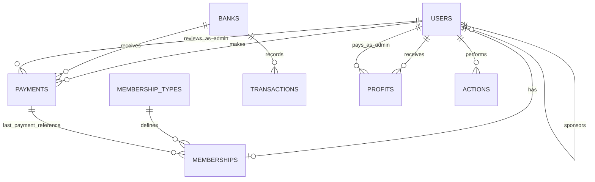

# DER Final - Affiliate System

## 1. Entity-Relationship Diagram (Mermaid)

## 2. Cardinality summary
- `users` 1 --- 0..1 `memberships`
- `membership_types` 1 --- N `memberships`
- `users` 1 --- N `users` (referral by `sponsor_id`)
- `users` 1 --- N `payments`
- `banks` 1 --- N `payments`
- `banks` 1 --- N `transactions`
- `users` 1 --- N `profits`
- `users` 1 --- N `actions`

## 3. Implementation notes
- `admin` exists in `users` with role `admin` and does not have row in `memberships`.
- All `user` role accounts must have exactly one row in `memberships`.
- `membership_types.name` must be UNIQUE at database level.
- `memberships.user_id` must be UNIQUE at database level (1:1 with `users`).
- `memberships.last_payment_id` references latest effective payment (nullable).
- `actions` is append-only for audit integrity.
- `profits.state` uses `pending` and `made` in this phase.
- `profits.period_month` (first day of month, e.g. `2026-03-01`) supports monthly payout visibility for admin.
