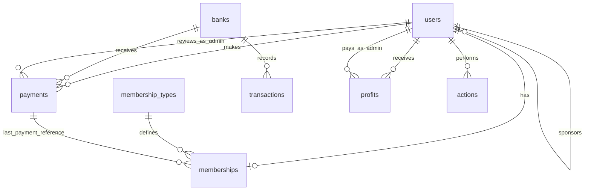

# Documento de requisitos del sistema de Afiliados

## 1) Decisiones funcionales base

### 1.1 Roles y membresías
- Solo existirán 2 roles de autorización (Spatie): `admin` y `user`.
- La membresía **no** se modela como rol.
- Todo `user` tendrá una membresía (relación 1:1).
- El `admin` no tiene membresía.

### 1.2 Convención de nombres
- Todas las tablas del sistema se nombrarán en inglés.
- Se usará `snake_case` para columnas.

## 2) Reglas de negocio (Afiliados)

1. El registro inicial de un usuario cuesta **$147** y activa membresía por **2 meses**.
2. La renovación cuesta **$97**.
3. Todo usuario tiene sponsor, excepto el admin.
4. Para simplificar integridad, el admin tendrá `sponsor_id = id` (self reference).
5. Si un usuario no tiene membresía pagada activa, su tipo de membresía es `free`.
6. El tipo de membresía depende de invitados activos (no `free`):
	 - `beginner`: de 3 a 9
	 - `explorer`: de 10 a 19
	 - `professional`: de 20 a 29
	 - `elite`: 30 o más
7. Al aprobarse un pago, se actualiza vigencia de membresía (`expires_at`).

## 3) Catálogo de membresías

Los tipos de membresía serán:
- `free`
- `customer`
- `beginner`
- `explorer`
- `professional`
- `elite`

> `admin` no pertenece al catálogo de membresías porque es un rol de seguridad, no una membresía.

## 4) Modelo de datos propuesto (requisitos)

### 4.1 `users`
Campos clave:
- `id`
- `name`, `email`, `password`
- `sponsor_id` (FK a `users.id`)
- `commission_balance` (decimal, acumulado)
- `created_at`, `updated_at`

Reglas:
- `sponsor_id` requerido para todos los usuarios.
- Para admin: `sponsor_id = id`.

### 4.2 `membership_types`
Campos clave:
- `id`
- `name` (unique)
- `affiliates_required` (int)
- `cost` (decimal)
- `profit` (decimal)
- `created_at`, `updated_at`

Valores iniciales esperados:
- `free`: affiliates 0, cost 0, profit 0
- `customer`: affiliates 0, cost 97 (o 147 en alta inicial por regla de negocio), profit 0
- `beginner`: affiliates 3, cost 0, profit 0
- `explorer`: affiliates 10, cost 0, profit 100
- `professional`: affiliates 20, cost 0, profit 200
- `elite`: affiliates 30, cost 0, profit 300

### 4.3 `memberships`
Tabla 1:1 con `users` (solo para rol `user`).

Campos clave:
- `id`
- `user_id` (unique, FK a `users.id`)
- `membership_type_id` (FK a `membership_types.id`)
- `status` (`active`, `free`, `expired`, `pending_payment`)
- `started_at`
- `expires_at`
- `last_payment_id` (nullable, FK a `payments.id`)
- `created_at`, `updated_at`

### 4.4 `banks`
Métodos/cuentas de pago administradas por el admin.

Campos clave:
- `id`
- `name`
- `owner`
- `identification`
- `number`
- `amount` (saldo actual)
- `detail`
- `photo`
- `created_at`, `updated_at`

### 4.5 `transactions`
Movimientos de bancos.

Campos clave:
- `id`
- `bank_id` (FK)
- `type` (`income`, `expense`)
- `amount_previous`
- `amount`
- `amount_now`
- `detail`
- `is_annulled` (bool)
- `created_at`

### 4.6 `payments`
Pagos que realizan los usuarios (excepto admin).

Campos clave:
- `id`
- `user_id` (FK)
- `bank_id` (FK)
- `number`
- `photo`
- `amount`
- `state` (`approved`, `rejected`, `pending`)
- `reviewed_by` (nullable, FK a `users.id`, admin)
- `reviewed_at` (nullable)
- `created_at`, `updated_at`

### 4.7 `profits`
Registra pagos de utilidades/comisiones a usuarios.

Campos clave:
- `id`
- `user_id` (FK)
- `amount`
- `state` (`pending`, `made`)
- `detail`
- `paid_by` (nullable, FK a `users.id`, admin)
- `paid_at` (nullable)
- `created_at`, `updated_at`

Reglas mínimas del módulo de comisiones (fase actual):
- El sistema debe permitir al admin visualizar el total mensual proyectado y pendiente por pagar.
- `pending` representa comisión calculada no pagada.
- `made` representa comisión ya pagada al usuario.
- La fórmula detallada de comisiones se definirá en una fase posterior y dependerá de membresía/tipo de membresía.

### 4.8 `actions` (módulo de auditoría)
Registro de trazabilidad de vistas y acciones del sistema.

Campos clave:
- `id`
- `user_id` (nullable, FK a `users.id`)
- `module` (ej. `users`, `memberships`, `payments`)
- `action` (ej. `view_index`, `view_show`, `create`, `update`, `delete`, `approve_payment`, `login`)
- `method` (`GET`, `POST`, `PUT`, `PATCH`, `DELETE`)
- `route`
- `url`
- `ip_address`
- `user_agent`
- `payload` (json, nullable)
- `old_values` (json, nullable)
- `new_values` (json, nullable)
- `created_at`

Regla: se debe registrar toda vista y acción relevante del sistema.

## 5) Módulo de Seguridad

### 5.1 Autorización
- Controllers: proteger acciones con `Gate`.
- Vistas Blade: usar `@canany` para mostrar/ocultar botones, enlaces y secciones.

### 5.2 Permisos base por módulo
Se define una matriz de permisos estándar por cada módulo del sistema:
- ver módulo (`view {module}`)
- crear módulo (`create {module}`)
- editar módulo (`edit {module}`)
- eliminar módulo (`delete {module}`)
- gestionar módulo (`manage {module}`)
- generar reporte módulo (`report {module}`)

Módulos iniciales:
- `users`
- `memberships`
- `membership_types`
- `banks`
- `transactions`
- `payments`
- `profits`
- `actions`

### 5.3 Asignación inicial sugerida
- `admin`: todos los permisos.
- `user`: permisos limitados de su panel (perfil, pagos propios, visualización de su membresía y su red).

## 6) Módulo de Auditoría

Objetivo: trazabilidad completa de operación y seguridad.

Requisitos:
1. Registrar acceso a vistas principales (`index`, `show`, `dashboard`, etc.).
2. Registrar acciones de escritura (`create`, `update`, `delete`, `approve`, `reject`, `annul`).
3. Registrar eventos de autenticación (`login`, `logout`, intentos fallidos si aplica).
4. Guardar actor, ruta, método, IP, agente y cambios de datos (`old_values`/`new_values`).
5. Permitir consulta por rango de fechas, usuario, módulo y acción.

## 7) Historias de usuario (alto nivel)

### HU-01 Registro con sponsor
Como visitante, quiero registrarme con sponsor para ingresar al sistema como `user` con membresía inicial.

### HU-02 Carga de pago
Como usuario, quiero registrar un pago con comprobante para activar o renovar membresía.

### HU-03 Revisión de pago
Como admin, quiero aprobar/rechazar pagos para controlar la activación y vencimiento de membresías.

### HU-04 Cambio de nivel por red
Como sistema, quiero recalcular el tipo de membresía según afiliados activos para asignar nivel correcto.

### HU-05 Trazabilidad
Como admin, quiero auditar vistas y acciones para control operativo y de seguridad.

### HU-06 Control de acceso
Como sistema, quiero validar permisos por módulo para que cada perfil vea/ejecute solo lo autorizado.

### HU-07 Vista mensual de comisiones (admin)
Como admin, quiero ver cuánto se pagará en el mes a los usuarios para planificar flujo de caja.

### HU-08 Ejecución de pagos de comisiones (admin)
Como admin, quiero marcar comisiones como pagadas para llevar control de pendientes y pagadas.

### HU-09 Consulta de estado de comisión (user)
Como usuario, quiero ver el estado de mis comisiones para saber cuáles están pendientes y cuáles ya fueron pagadas.

## 8) Diagrama lógico inicial (Mermaid)

## 9) Criterios de cierre de esta fase (análisis)

- Modelo validado: roles (`admin`, `user`) separados de membresías.
- Catálogo de membresías definido.
- Reglas de afiliación, pagos y vigencia definidas.
- Reglas base del módulo de comisiones definidas (sin fórmula detallada aún).
- Requisitos de seguridad y auditoría definidos.
- Historias de usuario y diagrama lógico inicial listos para pasar a diseño de base de datos.

## 10) Documento complementario

- El diccionario de datos técnico (tipos SQL, índices y FKs) está en `docs/data_dictionary.md`.
- El DER final del sistema está en `docs/der_final.md`.
- El checklist operativo de migraciones está en `docs/migration_checklist.md`.
